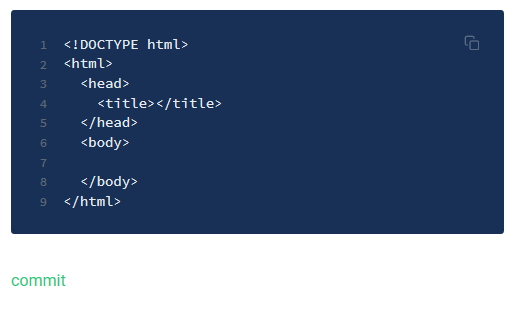

# Introducción

Este es un resumen ejecutivo de los primeros pasos del aprendizaje de desarrollo web con HTML, CSS y JavaScript, el cual dejo a disposición en [GitBook ](https://maodecolombia.gitbook.io/html-and-css/)y [GitHub](https://github.com/MaodeColombia-library/HTML-CSS-JavaScript_overview). La información que se encuentra en GitHub es la secuencia de commit desarrollado con este resumen

Es importante aprender HTML, CSS y JavaScript para no limitarnos en la creación de paginas WEB, se pueden encontrar en el mercado opciones como "plantillas estáticas" o "platillas con acceso al código"

| proveedor | modalidad |
| :--- | :--- |
| WIX | plantillas sin acceso al código por tanto se considera estática |
| weebly | plantillas con acceso al código que permiten hacer cambios sobre el HTML CSS y JavaScript |
|  |  |

como todo esta basado en GitBook, [GitBookDocs](https://docs.gitbook.com/)

