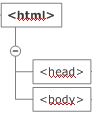
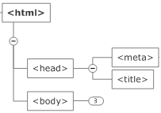

# Estructura básica de una página WEB - HTML, CSS y JavaScript

[HTML](https://developer.mozilla.org/es/docs/Learn/HTML/Introduccion_a_HTML/iniciar) es un lenguaje que nos permite definir **la estructura** de las páginas Web. **CSS** es un lenguaje que nos permite definir **el formato \(los estilos\)** de los elementos HTML. **JavaScript** es lenguaje de programacion que permite agregar interactividad a la página WEB y toso esto se esxplica por si solo con esta [muestra](https://html-css-js.com/)


### Anatomía de un documento HTML <a id="Anatom&#xED;a_de_un_documento_HTML"></a>

 El [elemento HTML](https://developer.mozilla.org/es/docs/Web/HTML/Elemento/html) `<html> </html>`representa la raíz de un documento HTML, el resto de elementos descienden de este elemento. El contenido permitido dentro de las etiquetas HTML es **un** elemento [`<head>`](https://developer.mozilla.org/es/docs/Web/HTML/Elemento/head) seguido de **un** elemento [`<body>`](https://developer.mozilla.org/es/docs/Web/HTML/Elemento/body)



```HTML
<!DOCTYPE html>
<html>
  <head>  </head>
  <body>  </body>
</html>
```

[commit](https://github.com/MaodeColombia/HTML-CSS/commit/4c1a970eba3ec8ecbe53441665745433a4a9bdca)

El elemento `<!DOCTYPE html>` en sus inicios, cuando el HTML llevaba poco tiempo \(alrededor de 1991-1992\), los _doctypes_ servían como enlaces al conjunto de reglas que la página HTML debía seguir para que fuera considerado buen HTML, lo que podía significar poder efectuar una comprobación automática de errores y otras funcionalidades útiles. En la actualidad se ignora y se considera un **legado histórico que hay que incluir** para que todo funcione correctamente.

El elemento `<head></head>` actúa como **contenedor para todos los parámetros que quieras incluir en el documento HTML que** _**no será**_ **visible a los visitantes de la página**

El elemento `<body></body>` actúa como **contenedor para todo el contenido que quieres mostrar a los usuarios** cuando visitan tu página

Dentro de la etiqueta `<head>` se encuentra el elemento `<title></title>`, `<meta charset="utf-8">` .



El elemento `<title></title>` **establece el título de tu página**, que aparece en la pestaña/ventana de tu navegador cuando la página se carga,tambien se utiliza para describir la página cuando la añades a tus marcadores o la marcas como favorita y es _el factor más importante de la optimización on-page básica de una Web_

El elemento `<meta charset="utf-8">` **establece que el documento HTML usará la codificación UTF-8**, que incluye la gran mayoría de caracteres de todos los idiomas humanos escritos.


### Inclusión de caracteres especiales en HTML <a id="Referencias_a_entidades_Inclusi&#xF3;n_de_caracteres_especiales_en_HTML"></a>

\[\]... carácter de referencia comienza con un signo de ampersand \(&\) y finaliza con un punto y coma \(;\).

```text
<p>En HTML, defines un párrafo con el elemento <p>.</p>
<p>En HTML, defines un párrafo con el elemento &lt;p&gt;.</p>
```


HTML de forma predeterminada define cada característica del "documento", como el tamaño de la letra para el "Título 1" y que sea negrilla, el espaciado del interlineado, el ícono de las villnetas, asi que aquí es cuando CSS aparece para interactuar con el código para agregarle _estilos._

Hay  tres partes donde se puede agregar los estilos CSS

1. Dentro de la etiqueta HTML a la que se le aplicará el estilo, lo cual se considera una mala practica, ademas que no se recomienda mezclar HTML y CSS en el mismo archivo
2. dentro de un sección llamada &lt;style&gt;
3. en un archivo fuera del código HTML que se está desarrollando
