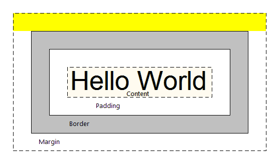

# Retos

## ¡Hola HTML!

Este reto es modificar el código para que el texto "HTML" aparezca en negrita como se muestra en la siguiente imagen:


```markup
<!DOCTYPE html>
<html>
  <head></head>
  <body>  
    ¡Hola HTML!
  </body>
</html>
```

### Instrucciones

1. Modifica el código para que el texto "HTML" aparezca en negrita \(solo la palabra, sin signo de exclamación\).

### Discusión: Hola mundo

La solución es la siguiente:

```markup
<!DOCTYPE html>
<html>
  <head></head>
  <body>
    ¡Hola <strong>HTML</strong>!
  </body>
</html>
```


Existen dos elementos que cumplen la misma función de mostrar texto en negrita `<b>` y `<strong>`, pero ahora es más común `<strong>` .


## Etiquetas

Este reto es modificar el código para obtener el siguiente resultado:


```markup
<!DOCTYPE html>
<html>
  <head></head>
  <body>
    Este es el título

    Este es el primer párrafo.

    Este es el segundo párrafo.
  </body>
</html>
```

### Instrucciones

1. Modifica el archivo para lograr el resultado esperado usando las etiquetas `h1` y `p`, y `strong`.

### **Discusión:** Etiquetas

```markup
<!DOCTYPE html>
<html>
  <head></head>
  <body>
    <h1>Este es el título</h1>
    <p>Este es el primer <strong>párrafo</strong>. </p>
    <p>Este es el segundo <strong>párrafo</strong>.</p>
  </body>
</html>
```


El [elemento](https://developer.mozilla.org/es/docs/Learn/HTML/Introduccion_a_HTML/iniciar#Anatom%C3%ADa_de_un_elemento_HTML) lo conforman la suma de la **etiqueta de apertura**, la **etiqueta de cierre** y el **contenido**. 

HTML también tiene [elementos vacíos](https://developer.mozilla.org/en-US/docs/Learn/HTML/Introduction_to_HTML/Getting_started#Empty_elements) que no siguen este patrón, como por ejemplo el elemento ``



Se ha difundido mucho llamar a etiquetas porque el acrónimo de HTML es "HyperText **Markup** Language" "lenguaje de **marcas-marquillas-etiquetas** de hipertexto"



Listado de Elementos HTML [Mozilla](https://developer.mozilla.org/en-US/docs/Web/HTML/Element) y [w3schools](https://www.w3schools.com/tags/default.asp)


## ¡Hypertexto!

El reto es que el texto **"Ver más"** dentro de el código sea un vínculo \(link\) que nos lleve a este [enlace](http://blog.makeitreal.camp/html-css) \(ver [enlace ](../../post-1/html-y-css-post.md)interno\).

```markup
<!DOCTYPE html>
<html>
  <head></head>
  <body>
    <h1>HTML y CSS</h1>

    <p>Para hacer páginas Web necesitas aprender dos lenguajes:
      HTML y CSS. Estos son los lenguajes que los navegadores
      (Firefox, Chrome, Internet Explorer) entienden e interpretan
      para mostrarte lo que ves cuando abres alguna página.</p>

    Ver más
  </body>
</html>
```

### Instrucciones

1. Abre el enlace y copia la URL.
2. Identifica el texto **Ver más** en el código y agrega el link.

### **Discusión:** ¡Hypertexto!

La solución es

```markup
<!DOCTYPE html>
<html>
  <head></head>
  <body>
    <h1>HTML y CSS</h1>

    <p>Para hacer páginas Web necesitas aprender dos lenguajes:
      HTML y CSS. Estos son los lenguajes que los navegadores
      (Firefox, Chrome, Internet Explorer) entienden e interpretan
      para mostrarte lo que ves cuando abres alguna página.</p>

    <a href="http://blog.makeitreal.camp/html-css">Ver más</a>
  </body>
</html>
```


[Hypertexto](https://www.w3.org/WhatIs.html) \(en inglés hypertext\) significa: texto con vínculos a otros textos, de ahí vienen el nombre **HTML \(Hyper Text Markup Language\)**: un **lenguaje** que nos permite definir la estructura \(**markup**\) de textos \(documentos\) con vínculos a otros documentos \(**hypertexto**\).



**Dato curioso:** Técnicamente deberíamos cambiarle el nombre a HTML por HMML \(Hyper **Media** Markup Language\) porque ahora HTML soporta no solo texto, sino imágenes, audio y video. Pero al parecer nadie ha propuesto el cambio y la verdad no valdría la pena en este momento ;\)



 `<a>` significa ancla

* **href**: El valor de este atributo indica la dirección web a la que se quiere que apunte el enlace, que será hacia donde nos lleve el navegador cuando se hace clic sobre el elemento. Por ejemplo, `href="https://www.mozilla.org/"`.
* **title**: El atributo title añade información adicional sobre el enlace, como puede ser el título de la página que vinculas, por ejemplo, `title="La página de inicio de Mozilla"` es la información que aparecerá cuando se le pase el ratón por encima.
* **target**: El atributo target especifica el contexto de navegación que va a usar para mostrar el enlace. Por ejemplo, `target="_blank"` mostrará el enlace en una pestaña nueva

```markup
<p>A link to my favorite <a href="https://www.mozilla.org/" title="La página de inicio de Mozilla" target="_black">website</a>.</p>
```

[referencia de mozilla](https://developer.mozilla.org/es/docs/Learn/HTML/Introduccion_a_HTML/iniciar#Aprendizaje_activo_A%C3%B1adir_atributos_a_un_elemento//)


## El título de la página

Este reto es agregarle el título "El movimiento open source" al documento HTML que se encuentra en el código como se muestra en la siguiente imagen:


```markup
<!DOCTYPE html>
<html>
  <head></head>
  <body>
    <h1>HTML y CSS</h1>

    <p>Para hacer páginas Web necesitas aprender dos lenguajes:
      HTML y CSS. Estos son los lenguajes que los navegadores
      (Firefox, Chrome, Internet Explorer) entienden e interpretan
      para mostrarte lo que ves cuando abres alguna página.</p>

    Ver más
  </body>
</html>
```

### Instrucciones

1. Agrega el título "El movimiento open source" al código.

### **Discusión:** El título de la página

La solución es

```markup
<!DOCTYPE html>
<html>
  <head>
  <title>El movimiento open source</title>
  </head>
  <body>
    <h1>Open Source</h1>
    <p>Open source (código abierto) es un movimiento que se originó por la
      ambigüedad del término <em>free software (software libre)</em>. El
      problema es que en Inglés la palabra <em>free</em> también significa
      <em>gratis</em>, pero open source no necesariamente es gratis.</p>

    <p>El objetivo del movimiento es que todos tengan la capacidad de ver el
      código del software que están adquiriendo. Pero existe mucho software
      open source que no es gratis, especialmente para uso comercial. Un
      ejemplo es <a href="https://source.android.com/">Android</a>, que
      aunque es un proyecto open source, no significa que cualquiera pueda
      comercializar teléfonos con ese sistema operativo.</p>
  </body>
</html>
```


Un documento HTML tiene dos grandes secciones: el encabezado `<head>` y el cuerpo `<body>` como se muestra en el siguiente ejemplo:

```markup
<!DOCTYPE html>
<html>
  <head>
    ...
  </head>
  <body>
    ...
  </body>
</html>
```

La primera línea `<!DOCTYPE html>` le dice al navegador que estamos usando la última versión de HTML, HTML5. Un documento HTML siempre empieza con la etiqueta `<html>`.

En el `<head>` va información que no es visible en la pantalla como el **título del documento**, referencia a otros archivos, etc. En el `<body>` van los elementos visibles en la pantalla.


## Una deliciosa receta

Este reto es crear una página con la receta de una ensalada. El resultado final debe quedar igual al que se muestra a continuación:


```markup
<!-- NOTE: no se cuenta con código base -->
```

### Instrucciones

1. Agrega la estructura básica que debe tener todo HTML.
2. El título de la página debe ser `Mis Recetas`.
3. La imagen se encuentra en [https://s3.amazonaws.com/makeitreal/salad.png](https://s3.amazonaws.com/makeitreal/salad.png).
4. Utiliza las etiquetas `h1`, `h2`, `img`, `ul`, `li`, y `p` para crear el contenido de la página.

### **Discusión:** Una deliciosa receta

```markup
<!DOCTYPE html>
<html>
<head>
  <meta charset="UTF-8">
  <title>Mis Recetas</title>
</head>
<body>
  <h1>Receta: Ensalada</h1>
  

  <h2>Ingredientes</h2>
  <p>Los ingredientes necesarios para preparar la ensalada son los siguientes:</p>
  <ul>
    <li>Pechuga</li>
    <li>Lechuga</li>
    <li>Tomate</li>
    <li>Cebolla</li>
    <li>Maiz</li>
  </ul>

  <h2>Preparación</h2>
  <p>Se pican todos los ingredientes, se mezclan y listo!</p>
</body>
</html>
```

[HTML \(Hyper Text Markup Lenguage\)](https://es.wikipedia.org/wiki/HTML) fue creado en 1989, junto a [HTTP \(Hyper Text Markup Protocol\)](https://es.wikipedia.org/wiki/Hypertext_Transfer_Protocol), como parte del proyecto [World Wide Web \(WWW\)](https://es.wikipedia.org/wiki/World_Wide_Web). El objetivo inicial de WWW era permitir publicar y compartir documentos académicos dentro de [CERN](https://es.wikipedia.org/wiki/Organizaci%C3%B3n_Europea_para_la_Investigaci%C3%B3n_Nuclear) \(donde se encuentra el acelerador de partículas más grande del mundo\).

HTML permitiría definir la estructura de un documento, es decir, encabezados, párrafos, listas, etc. \(en ese momento no se podían incluir imágenes, video, o audio\). Pero lo realmente novedoso era que HTML permitiría incluir vínculos a otros documentos, creando así una **red de documentos interconectados**.Generalmente, el código HTML \(Hyper Text Markup Language\) viaja a través de HTTP \(Hyper Text Transfer Protocol\). Pero es posible crear un archivo de texto con extensión `.html` y abrirlo en un navegador directamente.


 La etiqueta `<meta charset="UTF-8">` dentro de `<head>` se usa para que las tildes funcionen.



El _atributo_ `alt` del _elemento_ `` define el texto alternativo que describe la imagen, texto que los usuarios verán si la URL de la imagen es errónea o la imagen tiene un formato no soportado o si la imagen aún no se ha descargado.

[referencia a mozilla](https://developer.mozilla.org/en-US/docs/Web/HTML/Element/img)



## Cambiando el color del texto

Este reto es cambiar el color del texto que se encuentra dentro de la etiqueta `span` a rojo \(`#FF0000`\) como se muestra en la siguiente imagen:


```markup
<!DOCTYPE html>
<html>
  <head></head>
  <body>
    <h1>¿Qué es una dirección IP?</h1>

    <p>Una dirección IP es una cadena de texto que identifca a un
      computador dentro de una red. Actualmente las direcciones IP
      consisten de 4 números (de 0 a 255 cada uno) separados por
      punto (.). <span>Ejemplos de direcciones IP incluyen 54.23.172.178
      o 216.76.234.12</span>.</p>
  </body>
</html>
```

### Instrucciones

1. Realiza el cambio en el código

### **Discusión:** Cambiando el color del texto

Este reto se podía solucionar de varias formas. Primero, era posible encerrar el texto en la etiqueta `<font>`:


```markup
<font color="#FF0000"><span>...</span></font>
```

Esta etiqueta ha sido removida de HTML5 y **no se debe usar, nunca nunca**. La razón por la que el reto la acepta es que varios navegadores aún la soportan.


Recuerda que HTML define la estructura \(los elementos y el contenidos\) de los documentos, no la apariencia. Para eso se usa [CSS \(Cascading Style Sheets\)](https://es.wikipedia.org/wiki/Hoja_de_estilos_en_cascada), para aplicarle el estilo a los elementos del documento.

Otra opción era agregar el estilo en el atributo `style` de la etiqueta `span`:

```markup
<span style="color: red">...</span>
```

Esta es una mejor opción que la anterior porque se está usando CSS, pero no es una buena práctica porque mezcla el código HTML \(estructura\) con CSS \(estilos\).

Nuestra solución es la siguiente:

```markup
<!DOCTYPE html>
<html>
  <head>
    <style>
      .red { color: red; }
    </style>
  </head>
  <body>
    <h1>¿Qué es una dirección IP?</h1>
    <p>Una dirección IP es una cadena de texto que identifca a un computador dentro de una red. Actualmente las direcciones IP consisten de 4 números (de 0 a 255 cada uno) separados por punto (.). <span class="red">Ejemplos de direcciones IP incluyen 54.23.172.178 o 216.76.234.12</span>.</p>
  </body>
</html>
```

La razón por la que usamos una clase \(que llamamos `red`\) como selector, es que si usábamos la etiqueta `span`, eso afectaría a todas las etiquetas `span` del documento. Y eso puede que no sea lo que queramos.

#### La etiqueta span

La etiqueta `<span>` se usa para agrupar texto y aplicarle estilos, o para modificarlo usando JavaScript.


`<span>` es muy parecido a un elemento `<div>`, pero `<div>` es un _elemento de nivel de bloque_, mientras que `<span>` es un _elemento en línea_.


#### Formas de definir el color

La propiedad `color` define el color del texto y se puede especificar de 3 formas:

* Con un valor hexadecimal: p.e. `#ff0000`.
* Con un valor RGB: p.e. `rgb(255, 0, 0)`
* El color de un nombre: p.e. `red`.

## Teclado numérico

Este reto es crear un teclado numérico como el que se muestra en la siguiente imagen:


```markup
<!DOCTYPE html>
<html>
<head>
  <style>
    .dial td {
      background: #303030;
      color: white;
      font-size: 24px;
      padding: 10px 23px;
    }
  </style>
</head>
<body>
  <!-- crea la tabla acá -->  
</body>
</html>
```

### Instrucciones

1. En el archivo `index.html` crea una tabla y asígnale la clase `dial` para asignarle los estilos.
2. Agrega el cuerpo de la tabla para obtener el resultado esperado.
3. Utiliza las etiquetas `<table>`, `<tr>` y `<td>` para crear el contenido de la página.

### **Discusión:** Teclado numérico

Nuestra solución es la siguiente:

```markup
<!DOCTYPE html>
<html>
<head>
  <style>
    .dial, td {
      background: #303030;
      color: white;
      font-size: 24px;
      padding: 10px 23px;
    }
  </style>
</head>
<body>
  <table class="dial">
    <tr>
      <td>1</td>
      <td>2</td>
      <td>3</td>
    </tr>
    <tr>
      <td>4</td>
      <td>5</td>
      <td>6</td>
    </tr><tr>
      <td>7</td>
      <td>8</td>
      <td>9</td>
    </tr><tr>
      <td></td>
      <td>0</td>
      <td></td>
    </tr>
  </table>
</body>
</html>
```

## Libreta de Contactos

Este reto es crear una lista de contactos como se muestra en la siguiente imagen.


### Instrucciones

1. Agrega la estructura que todo HTML debe tener.
2. El título de la página debe ser **Libreta de Contactos**.
3. El archivo HTML debe tener una tabla que cumpla con las siguientes condiciones:
   * La tabla debe tener bordes de 1px como se muestra en la imagen.
   * La tabla debe tener un ancho de 100%.
   * La tabla debe tener 3 filas.
   * La primer fila debe estar compuesta por 5 table headers `<th>`
   * Las dos siguientes filas deben estar compuestas por 5 table cells `<td>`

```markup
<!-- NOTE: no se cuenta con código base -->
```

### **Discusión:** Libreta de Contactos

Nuestra solución es

```markup
<!DOCTYPE html>
<html>
  <head>
    <title>Libreta de Contactos</title>
    <style media="screen">
      .detalles{
        width:   100%;
        /* NOTE: usa el 100% del ancho documento*/
        height:  150px;}
        /* NOTE: Usa 150 pixeles de ancho de celda */
      .detalles, td, th {
      /* NOTE: agrego dondes de tabla tanto a las casillas como a la tabla */
         border:  1px solid grey;}
    </style>
  </head>
  <body>
    <table class="detalles">
      <tr>
        <th>Nombre</th>
        <th>Teléfono</th>
        <th>Dirección</th>
        <th>Email</th>
        <th>Empresa</th>
      </tr>
      <tr>
        <td>Germán Escobar</td>
        <td>3112111111</td>
        <td>Cll 34 #5c-34 Apto 1001</td>
        <td>german.escobarc@gmail.com</td>
        <td>La Nueva Educación</td>
      </tr>
      <tr>
        <td>Pedro Perez</td>
        <td>31435555555</td>
        <td>Av Poblado #8a-34 Apto 507</td>
        <td>pedro.perez@gmail.com</td>
        <td>Educación Colombia</td>
      </tr>
    </table>
  </body>
</html>
```





Recuerda, es mejor aplicar todos los estilos mediante CSS \(como se muestra en la solución\) y no en los atributos de la tabla.



[`<th>`](https://www.w3schools.com/tags/tag_th.asp) hace referencia`t` tabla, `h` header _encabezado_  
[`<tr>`](https://www.w3schools.com/tags/tag_tr.asp) hace referencia `t` tabla, `r` row _fila_  
[`<td>`](https://www.w3schools.com/tags/tag_td.asp) hace referencia `t` tabla, `d` data _dato_

`td` va anidado dentro de `tr` porque se le está diciendo los _datos_ que compondrán la _fila_; en términos prácticos la cantidad de columnas


## SCRUM

Este reto es aplicarle estilos al código HTML que se encuentra en el codigo para que se vea como en la siguiente imagen:


```markup
<!DOCTYPE html>
<html>
  <head>
    <style>
      a { color: #F04500; }
    </style>
  </head>
  <body>
    <div>
      <h1>Scrum</h1>
      <p>En los 80's y gran parte de los 90's se pensaba que
        construir software era como construir un edificio o un
        puente; que era posible planear todo primero, y luego,
        escribir el código sería como pegar ladrillos con cemento.
        A esa metodología se le llama <strong>en cascada</strong>
        (waterfall) y generó inmensas pérdidas para las empresas
        que la adoptaron.</p>

      <p>La realidad es que las aplicaciones están en constante
        evolución y siempre hay cambios inesperados sobre el camino.
        <a href="http://es.wikipedia.org/wiki/Scrum" target="_blank">Scrum</a>
        es una metodología de desarrollo ágil para proyectos
        de software que adopta esa filosofía. En vez de construir
        software en cascada, se construye en varias iteraciones
        cortas de forma incremental.</p>
    </div>
  </body>
</html>
```

### Instrucciones

1. Oprime el botón **Preview** para ver el estado actual.
2. En el archivo `index.html` modifica el código para obtener el resultado esperado. Los estilos que debes aplicar sobre el `div` son los siguientes:
   * El fondo es de color `#303030`.
   * El color de la letra es `#dfdfdf`.
   * La fuente es `'Helvetica Neue', Arial, sans-serif`.
   * El tamaño de la fuente es `18px`.
   * El alto de línea es `1.4`.
   * El padding es de `20px`.
   * El margin es de `40px`.
   * El `border-radius` es `5px`.

### **Discusión:** Scrum

Nuestra solución es la siguiente:

```markup
<!DOCTYPE html>
<html>
  <head>
    <style>
      a { color: #F04500; }
      /* NOTE: color del link */
      .article{
        background-color: #303030;
        /* NOTE: color de fondo de la sección */
        color:            #dfdfdf;
        /* NOTE: color de la fuente */
        font-family:      'Helvetica Neue', Arial, sans-serif;
        /* NOTE: define una lista-familia de fuentes, con un orden de prioridad*/
        font-size:        18px;
        padding:          20px;
        /* NOTE: establece el espacio de relleno requerido por todos los lados de un elemento. */
        margin:           40px auto;
        /* NOTE: establece el margen para los cuatro lados */
        border-radius:    5px;
        /* NOTE: permite definir qué tan redondeadas serán las esquinas */
      }
    </style>
  </head>
  <body>
    <div class="article">
      <h1>Scrum</h1>
      <p>En los 80's y gran parte de los 90's se pensaba que
        construir software era como construir un edificio o un
        puente; que era posible planear todo primero, y luego,
        escribir el código sería como pegar ladrillos con cemento.
        A esa metodología se le llama <strong>en cascada</strong>
        (waterfall) y generó inmensas pérdidas para las empresas
        que la adoptaron.</p>

      <p>La realidad es que las aplicaciones están en constante
        evolución y siempre hay cambios inesperados sobre el camino.
        <a href="http://es.wikipedia.org/wiki/Scrum" target="_blank">Scrum</a>
        es una metodología de desarrollo ágil para proyectos
        de software que adopta esa filosofía. En vez de construir
        software en cascada, se construye en varias iteraciones
        cortas de forma incremental.</p>
    </div>
  </body>
</html>
```

Primero, fíjate que hemos definido los estilos en la etiqueta `style` dentro del `head`. Eso es preferible a definir los **estilos inline** como se muestra en el siguiente ejemplo:

```markup
<div style="background: #303030; color: #dfdfdf; ...">
   ...
</div>
```

La razón es que con **estilos inline** estamos mezclando el código HTML con el código CSS.

Segundo, fíjate que le agregamos una clase `article` al `div` y usamos la **clase como selector** de la regla CSS en vez de usar la **etiqueta** como se muestra en el siguiente ejemplo:

```markup
div {
  background: #303030;
  color: #dfdfdf;
  ...
}
```

La razón es que si después agregamos otro `div` puede que no queramos que tenga el mismo estilo. La clase nos da más libertad en caso de que queramos aplicarle los mismos estilos a cualquier otra etiqueta.

### Algunas preguntas

1. El color de fondo se puede definir con `background` o `background-color`. ¿Por qué?  Sin llegar a transcribir es por una propiedad de "rápida escritura" \([Shorthand properties](https://developer.mozilla.org/en-US/docs/Web/CSS/Shorthand_properties)\) propia de CSS que no solo aplica a _Background_, sino tambien a _Font \_, \_Border_, \_Margin and padding_ [respuesta](https://developer.mozilla.org/en-US/docs/Web/CSS/Shorthand_properties) [complemento](https://developer.mozilla.org/en-US/docs/Web/CSS/background)
2. ~~_**¿Por qué la fuente de la etiqueta `h1` no cambia a `18px`?**_~~
3. ¿Cuál es la diferencia entre `padding` y `margin`?

   [repuesta](https://www.cssblog.es/diferencia-entre-margin-y-padding/)



Si deseas conocer o verificar tus respuestas puedes preguntarnos en el canal de Slack `#html-css-bootstrap`.

## Salúdame

Este reto es crear un formulario como el que se ve en la siguiente imagen:


```markup
<!DOCTYPE html>
<html>
  <head>
    <style>
      body { text-align: center; }
      input, button { font-size: 18px; }
    </style>
  </head>
  <body>

  </body>
</html>
```

Ten en cuenta las siguientes recomendaciones:

* El valor del atributo `action` del formulario `<form>` debe ser `/forms/hello`.
* El valor del atributo `name` del campo de texto debe ser `nombre`
* El botón debe ser de tipo `submit`.

### Instrucciones

1. Escribe tu solución. Usa una etiqueta `h1` para el encabezado y crea el formulario con el campo de texto y el botón para enviarlo.
2. Oprime el botón **Preview** y prueba que el formulario funcione: escribe tu nombre y oprime el botón **¡Hola!**. Deberá aparecer...

   

### **Discusión:** Salúdame

```markup
<!DOCTYPE html>
<html lang="en" dir="ltr">
  <head>
    <title>Home</title>
    <meta charset="utf-8">
    <style>
      body { text-align: center; }
      input, button { font-size: 18px; }
    </style>
  </head>
  <body>
    <h1>¿Cómo te llamas ?</h1>
    <form class="form_example" action=/forms/hello method="get">
      <!-- NOTE: action es la URL que procesa el envío del formulario <form> -->
      <input type="text" name="nombre">
      <!-- NOTE: uns variante interesante es <input type="text" name="name" required  minlength="4" maxlength="8" size="100">-->
      <input type="submit" name="nombre_loco"  value="¡Hola!">
    </form>
  </body>
</html>
```

¡Excelente trabajo Maker!  
  
Los formularios se usan generalmente para obtener información del usuario y enviarla al servidor. El atributo `name` nos permite identificar en el servidor los valores que ingresa el usuario en cada campo.


Existen dos formas de **enviar la información** que se controla con el atributo `method`. Los posibles valores son `get` y `post`.

* `method="get"` es la opción por defecto y envía la información a través de la URL \(p.e. `/forms/hello?nombre=Pedro`\).

```markup
<form action="..." method="get">
/*...*/
</form>
```

* `method="post"` envía la información en el cuerpo del mensaje HTTP y por lo tanto no es visible en la URL.

```markup
<form action="..." method="post">
/*...*/
</form>
```


¿Qué opción usar? En general la recomendación es usar `method="post"` a menos de que encuentres una buena razón para usar `GET` \(p.e. los formularios para buscar y filtrar datos son un buen caso de uso\).



Por último, el botón de enviar se puede crear de dos formas:

```markup
<input type="submit" value="¡Hola!">
```

o

```markup
<button type="submit">¡Hola!</button>
```

Las dos opciones son equivalentes pero es preferible la segunda que es más fácil de estilizar y nos ofrece más opciones como incluir imágenes y anidar otros elementos.

## El colegio y la creatividad

En este reto encontrarás dos archivos: `index.html` y `style.css`, en `style.css` se encuentran los estilos que le queremos aplicar al archivo `index.html`, pero aún no están conectados.

Tu misión en este reto es crear la referencia en el HTML al archivo CSS.



```markup
<!DOCTYPE html>
<html lang="en">
<head>
  <meta charset="UTF-8">
  <title>El efecto del colegio en la creatividad</title>
</head>
<body>
  <header>
    <div>
      <div class="row">
        <h1>El efecto del colegio en la creatividad</h1>
        <p>Es hora de repensar los principios fundamentales bajo los que estamos educando a nuestros hijos.</p>
      </div>
    </div>
  </header>
  <div class="details row">
    <div class="details-author"> <span>Germán Escobar</span></div><div class="details-date">13 de Junio del 2013</div>
  </div>
  <article class="row first">
    <p>Talvez el estudio más importante sobre creatividad realizado hasta ahora ha sido el de <a href="http://en.wikipedia.org/wiki/Mihaly_Csikszentmihalyi" target="_blank">Mihaly Csikszentmihalyi</a> resumido en su libro <a href="http://www.amazon.com/Creativity-Psychology-Discovery-Invention-ebook/dp/B000TG1X9C/ref=tmm_kin_title_0?ie=UTF8&qid=1371227982&sr=8-1" target="_blank">“Creatividad: Flujo y la Sicología del Descubrimiento e Invención”</a> que fue publicado por primera vez en el 96’. El estudio se basa en 91 entrevistas a personas creativas, reconocidas internacionalmente, cuyo trabajo ha impactado de una u otra forma nuestras vidas.</p>

    <p>Entre los diversos hallazgos hay uno que llama especialmente la atención: el efecto del colegio sobre las vidas de los entrevistados. El siguiente extracto del libro resume el resultado:</p>

    <blockquote>"Es extraño el poco efecto que el colegio -incluso el bachillerato- parece haber tenido en la vida de personas creativas. Muchas veces uno siente, si algo, que el colegio amenazó con extinguir el interés y la curiosidad que el niño había descubierto fuera de las paredes. ¿Qué tanto contribuyeron los colegios a los logros de Einstein, Picasso, o T.S. Eliot? El registro es bastante sombrío, especialmente considerando todo el esfuerzo, los recursos, y la esperanza que hemos puesto en nuestro sistema de educación formal."</blockquote>

    <p>Lo verdaderamente extraño es que el autor le haya parecido extraño ese resultado. Pero recordemos que no fue sino hasta el 2006 -cuando Sir Ken Robinson dio la popular y polémica charla en TED sobre cómo los colegios matan la creatividad- que la percepción de los colegios cambió.</p>
  </article>

  <div class="video">
    <div class="quote"></div>
    <iframe src="https://embed-ssl.ted.com/talks/lang/es/ken_robinson_says_schools_kill_creativity.html" width="640" height="360" frameborder="0" scrolling="no" webkitAllowFullScreen mozallowfullscreen allowFullScreen></iframe>
  </div>

  <article class="row">
    <p>¿Cómo lograron estas personas mantener su creatividad durante los oscuros años de colegio? Hay diferentes respuestas. Algunos mencionan a profesores individuales que los inspiraron, o que notaron y promovieron sus habilidades con un trato especial. Pero la gran mayoría no tiene ningún recuerdo de algún profesor que los haya impactado. Para muchos fueron años difíciles de soledad y rechazo que utilizaron para cultivar sus habilidades.</p>

    <p>Tampoco es de extrañar que ninguno de los entrevistados haya sido popular en el colegio. Ser popular es un trabajo de tiempo completo que requiere adaptarse a un círculo monocromático de amistades al punto de renunciar a su propia identidad. Y todavía hay algunos que no logran entender cómo es que todos terminan vistiéndose, peinándose y hablando de la misma forma. ¿Por qué no les enseñamos a nuestros hijos que está bien ser diferentes? ¿Que no hay necesidad de encajar? ¿Que el colegio no es el mundo real y sólo es una sociedad artificial creada con el propósito de dejar trabajar a los adultos mientras ellos llegan a una edad productiva?</p>

    <p>Lo más triste, como lo articula Paul Graham en su ensayo <a href="http://www.paulgraham.com/nerds.html" target="_blank">“Por qué los nerdos son impopulares”</a>, es que los jóvenes que no se adaptan se sienten miserables. Sienten que algo está mal con ellos.</p>

    <p>Si algún adulto volviera al colegio no le importaría lo que sus compañeros pensaran. No intentaría adaptarse porque se daría cuenta de lo artificial del contexto. Pero para los jóvenes ese es el mundo real. Y nadie les dice lo contrario.</p>

    <p>Tiene sentido que ninguna de las personas creativas del estudio haya sido popular en el colegio. Son personas que no se adaptan. Al contrario, son las que desafían el status quo, las que toman riesgos, las se apasionan por el aprendizaje, las que rompen paradigmas, y lo más importante, las que nunca dejan de ser curiosas.</p>

    <p>Ese es el problema del colegio. El alumno inteligente y estudioso lo odia porque su condición lo hace impopular. Y el popular también lo odia porque lo obligan a estudiar, distrayéndolo de su objetivo principal. No es interesante para ninguno.</p>
  </article>
</body>
</html>
```



```markup
html, body, header { height: 100%; }
body {
  color: #303030;
  font: 18px/28px Helvetica, Arial, sans-serif;
  margin: 0;
}

.row {
  width: 768px;
  margin-left: auto;
  margin-right: auto;
}

header {
  background: url('https://s3.amazonaws.com/makeitreal/creativity-post-assets/post2-bg.jpg') no-repeat 50%;
  background-size: cover;
  color: white;
}
header > div {
  position: absolute;
  top: 50%;
  width: 100%;
}
header h1 {
  line-height: 1.2;
  text-shadow: -2px 2px 5px #000;
  margin-bottom: 10px;
}
header p {
  font-size: 21px;
  font-weight: 300;
  text-shadow: -1px 1px 5px #000;
  margin: 0;
}

.details { 
  margin-top: 40px; 
  color: #666;
}
.details-author { 
  float: left;
  font-size: 21px;
}
.details-author img {
  width: 50px;
  border-radius: 25px;
  vertical-align: middle;
  margin-right: 15px;
}
.details-date {
  float: right;
  margin-top: 10px;
}

article.first { margin-top: 140px; }
article p { margin-bottom: 28px; }
blockquote {
  color: #666;
  font-style: italic;
  margin-top: 40px;
  margin-bottom: 40px;
}

.video {
  background: black;
  text-align: center;
  padding: 40px 0 30px;
  margin: 60px 0;
}
```



### Instrucciones

1. Oprime el botón **Preview** para ver el estado actual.
2. Incluye la referencia al CSS en `index.html`. Asume que el archivo `style.css` está en la misma carpeta que el archivo `index.html`.
3. Verifica que se hayan aplicado correctamente los estilos oprimiendo nuevamente **Preview**.
4. Oprime **Evaluar Solución** cuando hayas terminado.

###  **Discusión:** El colegio y la creatividad



```markup
<!DOCTYPE html>
<html lang="en">
<head>
  <meta charset="UTF-8">
  <title>El efecto del colegio en la creatividad</title>
  <link rel="stylesheet" href="style.css">
</head>
<body>
  <header>
    <div>
      <div class="row">
        <h1>El efecto del colegio en la creatividad</h1>
        <p>Es hora de repensar los principios fundamentales bajo los que estamos educando a nuestros hijos.</p>
      </div>
    </div>
  </header>
  <div class="details row">
    <div class="details-author"> <span>Germán Escobar</span></div><div class="details-date">13 de Junio del 2013</div>
  </div>
  <article class="row first">
    <p>Talvez el estudio más importante sobre creatividad realizado hasta ahora ha sido el de <a href="http://en.wikipedia.org/wiki/Mihaly_Csikszentmihalyi" target="_blank">Mihaly Csikszentmihalyi</a> resumido en su libro <a href="http://www.amazon.com/Creativity-Psychology-Discovery-Invention-ebook/dp/B000TG1X9C/ref=tmm_kin_title_0?ie=UTF8&qid=1371227982&sr=8-1" target="_blank">“Creatividad: Flujo y la Sicología del Descubrimiento e Invención”</a> que fue publicado por primera vez en el 96’. El estudio se basa en 91 entrevistas a personas creativas, reconocidas internacionalmente, cuyo trabajo ha impactado de una u otra forma nuestras vidas.</p>

    <p>Entre los diversos hallazgos hay uno que llama especialmente la atención: el efecto del colegio sobre las vidas de los entrevistados. El siguiente extracto del libro resume el resultado:</p>

    <blockquote>"Es extraño el poco efecto que el colegio -incluso el bachillerato- parece haber tenido en la vida de personas creativas. Muchas veces uno siente, si algo, que el colegio amenazó con extinguir el interés y la curiosidad que el niño había descubierto fuera de las paredes. ¿Qué tanto contribuyeron los colegios a los logros de Einstein, Picasso, o T.S. Eliot? El registro es bastante sombrío, especialmente considerando todo el esfuerzo, los recursos, y la esperanza que hemos puesto en nuestro sistema de educación formal."</blockquote>

    <p>Lo verdaderamente extraño es que el autor le haya parecido extraño ese resultado. Pero recordemos que no fue sino hasta el 2006 -cuando Sir Ken Robinson dio la popular y polémica charla en TED sobre cómo los colegios matan la creatividad- que la percepción de los colegios cambió.</p>
  </article>

  <div class="video">
    <div class="quote"></div>
    <iframe src="https://embed-ssl.ted.com/talks/lang/es/ken_robinson_says_schools_kill_creativity.html" width="640" height="360" frameborder="0" scrolling="no" webkitAllowFullScreen mozallowfullscreen allowFullScreen></iframe>
  </div>

  <article class="row">
    <p>¿Cómo lograron estas personas mantener su creatividad durante los oscuros años de colegio? Hay diferentes respuestas. Algunos mencionan a profesores individuales que los inspiraron, o que notaron y promovieron sus habilidades con un trato especial. Pero la gran mayoría no tiene ningún recuerdo de algún profesor que los haya impactado. Para muchos fueron años difíciles de soledad y rechazo que utilizaron para cultivar sus habilidades.</p>

    <p>Tampoco es de extrañar que ninguno de los entrevistados haya sido popular en el colegio. Ser popular es un trabajo de tiempo completo que requiere adaptarse a un círculo monocromático de amistades al punto de renunciar a su propia identidad. Y todavía hay algunos que no logran entender cómo es que todos terminan vistiéndose, peinándose y hablando de la misma forma. ¿Por qué no les enseñamos a nuestros hijos que está bien ser diferentes? ¿Que no hay necesidad de encajar? ¿Que el colegio no es el mundo real y sólo es una sociedad artificial creada con el propósito de dejar trabajar a los adultos mientras ellos llegan a una edad productiva?</p>

    <p>Lo más triste, como lo articula Paul Graham en su ensayo <a href="http://www.paulgraham.com/nerds.html" target="_blank">“Por qué los nerdos son impopulares”</a>, es que los jóvenes que no se adaptan se sienten miserables. Sienten que algo está mal con ellos.</p>

    <p>Si algún adulto volviera al colegio no le importaría lo que sus compañeros pensaran. No intentaría adaptarse porque se daría cuenta de lo artificial del contexto. Pero para los jóvenes ese es el mundo real. Y nadie les dice lo contrario.</p>

    <p>Tiene sentido que ninguna de las personas creativas del estudio haya sido popular en el colegio. Son personas que no se adaptan. Al contrario, son las que desafían el status quo, las que toman riesgos, las se apasionan por el aprendizaje, las que rompen paradigmas, y lo más importante, las que nunca dejan de ser curiosas.</p>

    <p>Ese es el problema del colegio. El alumno inteligente y estudioso lo odia porque su condición lo hace impopular. Y el popular también lo odia porque lo obligan a estudiar, distrayéndolo de su objetivo principal. No es interesante para ninguno.</p>
  </article>
</body>
</html>

```



```markup
html, body, header { height: 100%; }
body {
  color: #303030;
  font: 18px/28px Helvetica, Arial, sans-serif;
  margin: 0;
}

.row {
  width: 768px;
  margin-left: auto;
  margin-right: auto;
}

header {
  background: url('https://s3.amazonaws.com/makeitreal/creativity-post-assets/post2-bg.jpg') no-repeat 50%;
  background-size: cover;
  color: white;
}
header > div {
  position: absolute;
  top: 50%;
  width: 100%;
}
header h1 {
  line-height: 1.2;
  text-shadow: -2px 2px 5px #000;
  margin-bottom: 10px;
}
header p {
  font-size: 21px;
  font-weight: 300;
  text-shadow: -1px 1px 5px #000;
  margin: 0;
}

.details {
  margin-top: 40px;
  color: #666;
}
.details-author {
  float: left;
  font-size: 21px;
}
.details-author img {
  width: 50px;
  border-radius: 25px;
  vertical-align: middle;
  margin-right: 15px;
}
.details-date {
  float: right;
  margin-top: 10px;
}

article.first { margin-top: 140px; }
article p { margin-bottom: 28px; }
blockquote {
  color: #666;
  font-style: italic;
  margin-top: 40px;
  margin-bottom: 40px;
}

.video {
  background: black;
  text-align: center;
  padding: 40px 0 30px;
  margin: 60px 0;
}

```




Es una buena práctica separar el código CSS y HTML en archivos diferentes.


Cuando creas referencias a otros archivos \(imágenes, HTML, CSS, JavaScript, etc.\), puedes hacerlo de dos formas: usando **rutas relativas** \(relative paths\), o **rutas absolutas** \(absolute paths\).

Las **rutas relativas** se usan cuando el archivo se encuentra en el mismo servidor y  usualmente se espera que `style.css` esté en la misma carpeta que el archivo HTML. Veamos otros ejemplos de **rutas relativas**:


```markup
<link rel="stylesheet" href="style.css">
```

Usualmente los archivos que requieren referenciar no están dentro de la misma carpeta, están en un **nivel jerárquico inferior**, por ejemplo la **ruta relativa** al archivo `style.css` que se encuentra dentro de la carpeta `css` sería


```markup
<link rel="stylesheet" href="css/style.css">
```

otro ejemplo del mismo tipo,  link al archivo `about.html` que se encuentra dentro de la carpeta `company`


```markup
<a href="company/about.html">Acerca de Nosotros</a>
```

tambien se presenta, los archivos que requieren referenciar están en un **nivel jerárquico superior**, entonces la **ruta relativa** al archivo `vaca.png` que se encuentra dentro de la carpeta `image`sería


```markup

```


Los dos puntos `..` en la ruta relativa `../images/vaca.png` permite devolvernos a la carpeta de nivel superior



Las **rutas absolutas** se usan cuando el archivo no se encuentra en el mismo servidor. Por ejemplo:

```text

<a href="http://google.com/">Ir a Google</a>
```

En este caso estamos incluyendo una imagen y un link con **rutas absolutas** porque estos recursos no se encuentran en nuestro servidor.

